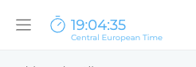
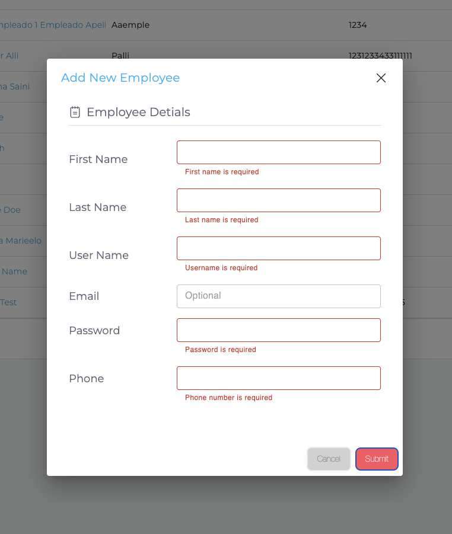
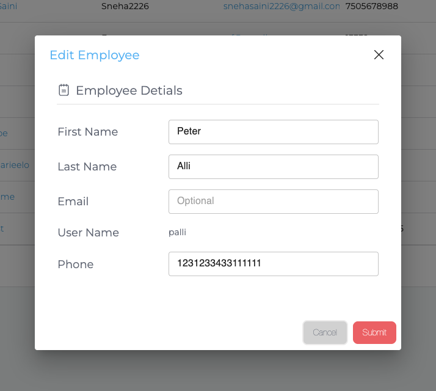
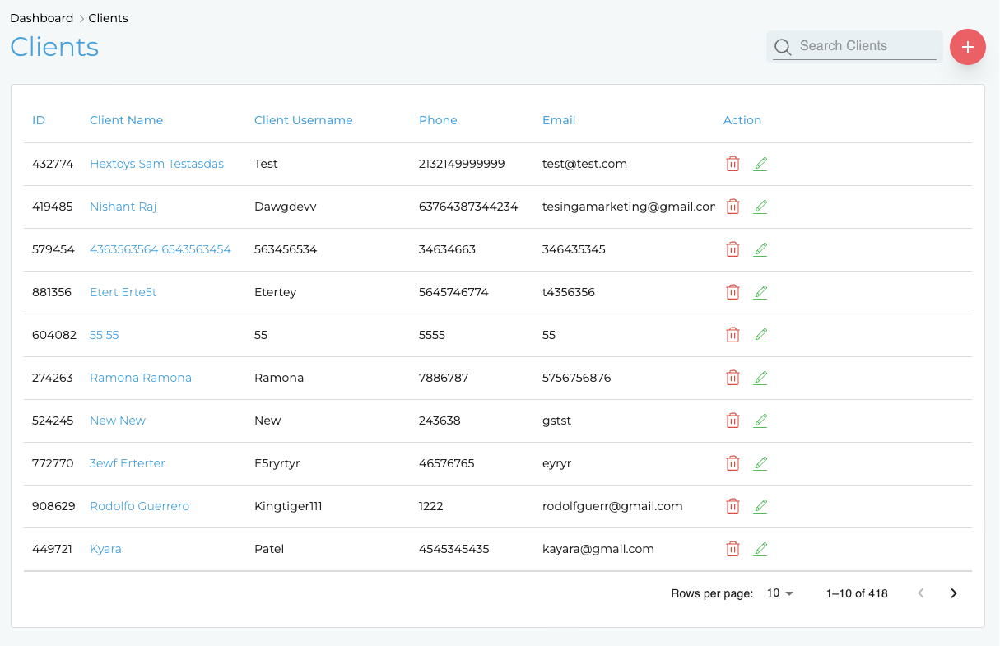
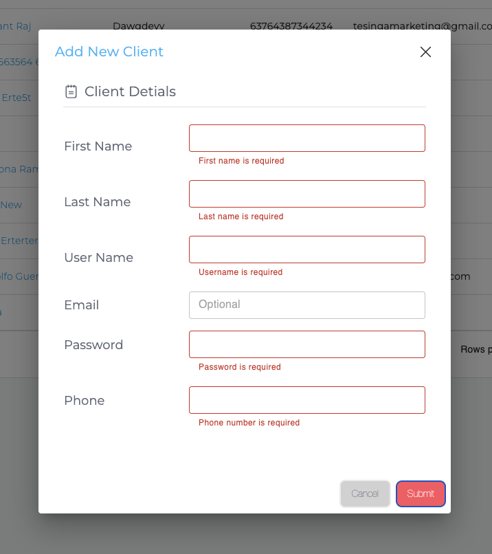
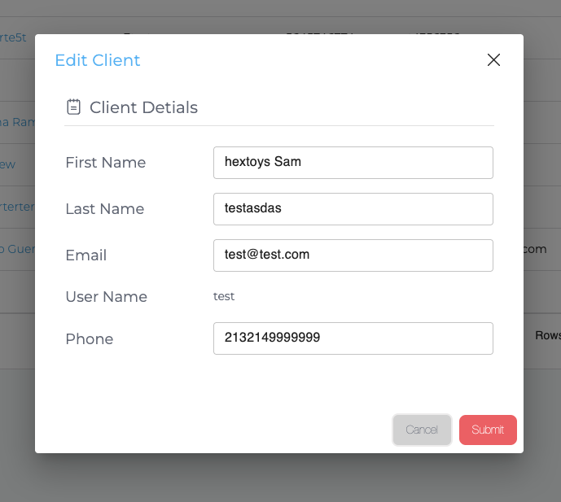

# Application Updates & Enhancements

This document outlines the recent updates and enhancements made to the React-Node application based on the technical assignment requirements.

## 🎯 Requirements Fulfilled

✅ **Display time zone on top bar** - Implemented with dynamic timezone detection
✅ **Form validation messages under fields** - Replaced alerts with inline validation
✅ **Add client button and modal** - Complete client management interface
✅ **Add client edit feature** - Edit functionality with pre-populated forms

All features have been implemented with consistent design patterns, proper validation, and enhanced user experience.

## Time Zone Display on Top Bar

**Feature**: Enhanced existing top navigation bar to display timezone information.

**Changes Made**:
- Modified `Navbar.jsx` to add `getTimezoneName()` function
- Updated time display layout to show timezone below current time
- Integrated with existing clock functionality

## Enhanced Form Validation for User Creation

**Feature**: Replaced alert-based validation with inline form validation messages.

**Changes Made**:
- Created new `useUserFormValidation.js` hook for reusable validation
- Modified existing `CreateEmployee.jsx` (renamed to `CreateUser.jsx`) to use new validation system
- Updated `Edit.jsx` (renamed to `EditUser.jsx`) with same validation approach
- Added real-time validation with error messages under each field
- Validates required fields: First Name, Last Name, Username, Password, and Phone

## Client Management Features

### Add Client Button and Modal

**Feature**: Enhanced existing client management interface with add functionality.

**Changes Made**:
- Modified existing `Clients.jsx` component to add "Add Client" button
- Integrated with existing user management system for consistency
- Added modal dialog for adding new clients with form validation

### Client Edit Feature

**Feature**: Added edit functionality for existing clients.

**Changes Made**:
- Added edit icons (green pencil) in the Action column for each client row
- Modified existing `EditUser.jsx` component to work for both employees and clients
- Pre-populated form fields with existing client data
- Username field is read-only in edit mode for security

## 🔧 Technical Improvements

### Code Organization
- Renamed components for consistency (`CreateEmployee.jsx` → `CreateUser.jsx`, `Edit.jsx` → `EditUser.jsx`)
- Created reusable validation hook for better code maintainability
- Updated backend controllers to handle both employee and client operations

### Form Validation System
- Centralized validation logic in `useUserFormValidation` hook
- Real-time validation with immediate feedback
- Consistent error handling across all user forms
- Support for both create and edit scenarios

### User Experience
- Improved visual feedback with red borders and error messages
- Consistent modal design across all user management features
- Better form state management and reset functionality
- Responsive design maintained across all new features

## 📁 Files Modified

### Frontend (Client)
- `src/Pages/Users/CreateUser.jsx` - Modified existing component with new validation system
- `src/Pages/Users/EditUser.jsx` - Modified existing component for both employee and client editing
- `src/Pages/Users/Clients.jsx` - Modified existing component to add client management features
- `src/Components/Navbar/Navbar.jsx` - Modified existing component to add timezone display
- `src/hooks/useUserFormValidation.js` - New validation hook
- `src/hooks/index.js` - New file to export validation hook
- `src/redux/action/user.js` - Modified existing Redux actions

### Backend (Server)
- `controllers/user.js` - Enhanced user management controllers with username validation consistency

### API Endpoint Refactoring
**Feature**: Standardized user validation to use username instead of email for consistency.

**Implementation**:
- Refactored both create and edit user endpoints to validate username existence
- Removed inconsistent email-based validation that was causing confusion
- Ensured all user operations (create, edit) follow the same validation pattern
- Improved data consistency across the application

## 📸 Demo Screenshots

### Timezone Display

*Top bar showing current time with timezone information*

### Form Validation

*"Add New Employee" modal showing red validation messages under empty required fields instead of using alert popups*

### Edit Employee Modal

*"Edit Employee" modal showing pre-filled employee information*

### Client Management Interface

*Clients page showing a clean interface with search functionality and a prominent "Add Client" button*

### Add Client Modal

*"Add New Client" modal with form validation for creating new clients*

### Edit Client Modal

*"Edit Client" modal showing pre-filled client information with the same validation system as the create form*
